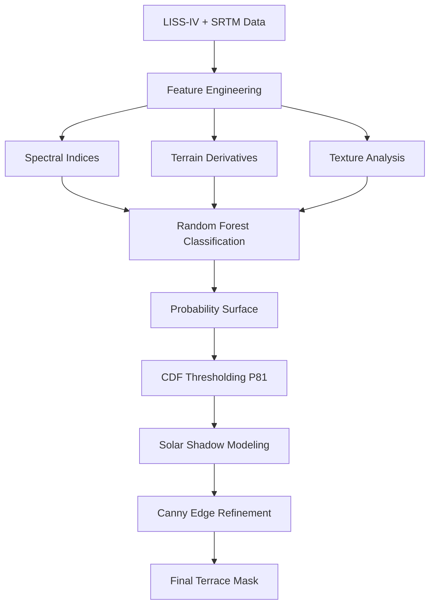

# Automated Terrace Classification and Machine Learning Evaluation in the Western Himalayas

[](https://earthengine.google.com/)
[](https://www.isro.gov.in/)
[](https://www.usgs.gov/centers/eros/science/usgs-eros-archive-digital-elevation-shuttle-radar-topography-mission-srtm-1)
[](https://opensource.org/licenses/MIT)

## Overview

A comprehensive **Google Earth Engine (GEE)** and **Python-based** framework for automated detection and classification of agricultural terraces in mountainous terrain. This study focuses on the **Aglar Basin** in the Garhwal region of Uttarakhand, India, implementing a hybrid methodology that combines high-resolution remote sensing with advanced machine learning techniques.

### Key Innovations
- **Multi-dimensional Feature Integration**: Spectral indices, terrain derivatives, and texture analysis
- **Solar Azimuth Shadow Modeling**: Physics-informed terrace detection using illumination geometry
- **Edge-aware Post-processing**: Canny edge detection on curvature derivatives
- **Comprehensive ML Evaluation**: Comparative analysis of 8 machine learning algorithms
- **Probabilistic Refinement**: CDF-based thresholding (P81) for improved spatial coherence

### Performance Highlights
- **Best Model**: CatBoost with **F1-score: 0.8298**, **MCC: 0.6513**, **Accuracy: 82.5%**
- **Runner-up**: Random Forest with **F1-score: 0.8278**, **ROC-AUC: 0.9082**
- **Dataset**: 3.08M pixel samples with balanced terrace/non-terrace classification

---

## 📊 Datasets & Specifications

| Dataset | Source | Resolution | Bands/Features | Application |
|---------|--------|------------|----------------|-------------|
| **LISS-IV Multispectral** | ISRO/Bhooonidhi | 5.8m | RGB + NIR | Spectral analysis, vegetation indices |
| **SRTM DEM** | USGS SRTMGL1_003 | 30m → 10m | Elevation | Terrain derivatives (slope, TPI, TRI) |
| **Sentinel-2** | ESA Copernicus | 10m | 27 bands | Extended spectral coverage (experimental) |

### Derived Features
- **Spectral Indices**: NDVI, SAVI, EVI, MSAVI, NDMI
- **Terrain Variables**: Slope, Aspect, TPI, TRI, Curvature, Hillshade
- **Texture Metrics**: GLCM-based NIR Entropy (3×3 kernel)
- **Edge Features**: Canny edge detection on curvature rasters
- **Solar Modeling**: Azimuth-informed shadow residual analysis (315° azimuth)

---

## 🔬 Technical Architecture

### Processing Workflow



### 1. **Feature Engineering Pipeline**

#### Spectral Analysis
```javascript
// NDVI calculation from LISS-IV
var ndvi = image.normalizedDifference(['NIR', 'Red']).rename('NDVI');

// SAVI with soil adjustment factor L=0.5
var savi = image.expression(
  '((NIR - Red) / (NIR + Red + L)) * (1 + L)',
  {
    'NIR': image.select('NIR'),
    'Red': image.select('Red'),
    'L': 0.5
  }
).rename('SAVI');
```

#### Terrain Derivatives
```javascript
// Slope and aspect from SRTM
var slope = ee.Terrain.slope(dem);
var aspect = ee.Terrain.aspect(dem);

// Topographic Position Index (TPI)
var tpi = dem.subtract(dem.focal_mean(1, 'square'));

// Terrain Ruggedness Index (TRI)
var tri = dem.focal_max(1).subtract(dem.focal_min(1));
```

#### Texture Analysis
```python
# GLCM-based NIR entropy calculation
def calculate_glcm_entropy(nir_band, window_size=3):
    entropy = skimage.feature.graycomatrix(
        nir_band, 
        distances=[1], 
        angles=[0, 45, 90, 135],
        properties=['entropy']
    )
    return entropy.mean()
```

### 2. **Solar Azimuth Shadow Modeling**

```javascript
// Hillshade with fixed solar geometry
var hillshade = ee.Terrain.hillshade(dem, 315, 45); // azimuth=315°, elevation=45°

// Shadow residual calculation
var shadowResidual = nir.subtract(hillshade.divide(255))
                        .abs()
                        .rename('shadow_residual');

// Identify shadow anomalies (potential terraces)
var shadowAnomalies = shadowResidual.gt(0.5);
```

### 3. **Machine Learning Implementation**

```python
# Model configuration
models = {
    'CatBoost': CatBoostClassifier(iterations=100, learning_rate=0.1),
    'XGBoost': XGBClassifier(n_estimators=100, max_depth=6),
    'LightGBM': LGBMClassifier(n_estimators=100, num_leaves=31),
    'RandomForest': RandomForestClassifier(n_estimators=100, criterion='gini'),
    'KNN': KNeighborsClassifier(n_neighbors=19),
    'LinearRegression': LinearRegression(),
    'SGDClassifier': SGDClassifier(loss='log', penalty='elasticnet'),
    'DecisionTree': DecisionTreeClassifier(criterion='gini')
}

# Evaluation metrics
metrics = ['accuracy', 'f1_score', 'matthews_corrcoef', 'roc_auc_score']
```

### 4. **Probabilistic Refinement**

```python
# CDF-based threshold selection
def calculate_p81_threshold(probabilities):
    """Calculate 81st percentile threshold for terrace classification"""
    return np.percentile(probabilities, 81)

# Apply threshold
p81_threshold = calculate_p81_threshold(rf_probabilities)
terrace_mask = rf_probabilities >= p81_threshold
```

### 5. **Edge-aware Post-processing**

```python
# Canny edge detection on curvature
def canny_edge_refinement(curvature_raster, sigma=1.3):
    # Gaussian smoothing
    smoothed = gaussian_filter(curvature_raster, sigma=sigma)
    
    # Canny edge detection
    edges = cv2.Canny(
        (smoothed * 255).astype(np.uint8),
        threshold1=int(0.10 * 255),
        threshold2=int(0.30 * 255)
    )
    return edges

# Refine terrace boundaries
edge_mask = canny_edge_refinement(curvature_data)
refined_terraces = terrace_mask & edge_mask
```

---

## 📈 Performance Results

### Model Comparison

| Algorithm | Accuracy | F1-Score | MCC | ROC-AUC | MSE | Kappa |
|-----------|----------|----------|-----|---------|-----|-------|
| **CatBoost** | **82.52%** | **0.8298** | **0.6513** | 0.9090 | **0.1205** | 0.6504 |
| Random Forest | 82.39% | 0.8278 | 0.6488 | **0.9082** | 0.1217 | 0.6478 |
| XGBoost | 82.39% | 0.8287 | 0.6489 | 0.9090 | 0.1222 | 0.6478 |
| LightGBM | 82.14% | 0.8257 | 0.6440 | 0.9078 | 0.1223 | 0.6428 |
| KNN | 81.70% | 0.8212 | 0.6355 | 0.9056 | 0.1266 | 0.6340 |
| Linear Regression | 79.10% | 0.7966 | 0.5849 | 0.8845 | 0.1441 | 0.5821 |
| Decision Tree | 75.80% | 0.7668 | 0.5168 | 0.7580 | 0.1667 | 0.5160 |
| SGD Classifier | 75.40% | 0.7617 | 0.5088 | 0.8414 | 0.1696 | 0.5080 |

### Key Findings
- **Ensemble methods** (CatBoost, XGBoost, Random Forest) consistently outperformed individual classifiers
- **CatBoost** achieved the best overall performance across multiple metrics
- **Linear models** struggled with complex terrain-spectral relationships
- **Tree-based methods** showed superior spatial coherence in terrace boundary delineation

---

## 🛠️ Installation & Setup

### Prerequisites
```bash
# Python dependencies
pip install earthengine-api
pip install scikit-learn
pip install catboost xgboost lightgbm
pip install opencv-python
pip install rasterio geopandas
```

### Google Earth Engine Setup
```bash
# Authenticate Earth Engine
earthengine authenticate

# Initialize in Python
import ee
ee.Authenticate()
ee.Initialize()
```

### Repository Structure
```
terrace-classification/
├── 📁 scripts/
│   ├── feature_engineering.js        # GEE feature extraction
│   ├── terrace_classification.py     # ML pipeline
│   ├── solar_shadow_modeling.js      # Shadow residual analysis
│   └── edge_refinement.py           # Canny edge processing
├── 📁 data/
│   ├── aglar_basin_boundary.shp     # Study area boundary
│   ├── training_polygons.shp        # Manual annotations (500 per class)
│   └── validation_points.shp        # Independent validation data
├── 📁 outputs/
│   ├── 📁 probability_maps/         # RF probability surfaces
│   ├── 📁 terrace_masks/           # Binary classification results
│   └── 📁 statistics/              # Performance metrics CSV
├── 📁 notebooks/
│   └── comparative_analysis.ipynb   # Model evaluation notebook
├── config.yaml                     # Analysis parameters
└── README.md
```

---

## 🚀 Usage Instructions

### 1. Feature Extraction (Google Earth Engine)

```javascript
// Load study area and imagery
var aoi = ee.FeatureCollection('projects/your-project/assets/aglar_basin');
var lissIV = ee.ImageCollection('your-liss-iv-collection')
             .filterBounds(aoi)
             .filterDate('2017-04-01', '2017-04-30');

// Calculate spectral indices
var ndvi = lissIV.map(function(img) {
  return img.normalizedDifference(['NIR', 'Red']).rename('NDVI');
});

// Derive terrain features
var srtm = ee.Image('USGS/SRTMGL1_003');
var slope = ee.Terrain.slope(srtm);
var tpi = srtm.subtract(srtm.focal_mean(1, 'square'));

// Export feature stack
var features = lissIV.addBands(ndvi).addBands(slope).addBands(tpi);
Export.image.toDrive({
  image: features,
  description: 'aglar_features',
  region: aoi,
  scale: 10,
  maxPixels: 1e13
});
```

### 2. Machine Learning Pipeline (Python)

```python
import pandas as pd
from sklearn.ensemble import RandomForestClassifier
from catboost import CatBoostClassifier

# Load preprocessed data
data = pd.read_csv('aglar_features.csv')
X = data[['NDVI', 'SAVI', 'slope', 'tpi', 'tri', 'nir_entropy']]
y = data['terrace_class']

# Train-test split
X_train, X_test, y_train, y_test = train_test_split(X, y, test_size=0.3, random_state=42)

# Train CatBoost model
model = CatBoostClassifier(iterations=100, learning_rate=0.1, verbose=False)
model.fit(X_train, y_train)

# Generate predictions
y_pred = model.predict(X_test)
y_prob = model.predict_proba(X_test)[:, 1]

# Apply P81 threshold
p81_threshold = np.percentile(y_prob, 81)
y_pred_p81 = (y_prob >= p81_threshold).astype(int)

# Evaluate performance
from sklearn.metrics import classification_report
print(classification_report(y_test, y_pred_p81))
```

### 3. Solar Shadow Analysis

```javascript
// Solar azimuth modeling (315° azimuth, 45° elevation)
var hillshade = ee.Terrain.hillshade(srtm, 315, 45);
var nirBand = lissIV.select('NIR');

// Calculate shadow residuals
var shadowResidual = nirBand.subtract(hillshade.divide(255))
                           .abs()
                           .rename('shadow_residual');

// Identify potential terrace locations
var shadowAnomalies = shadowResidual.gt(0.5);
```

### 4. Edge Refinement

```python
import cv2
from scipy.ndimage import gaussian_filter

def apply_canny_refinement(curvature_array, sigma=1.3):
    # Smooth curvature data
    smoothed = gaussian_filter(curvature_array, sigma=sigma)
    
    # Apply Canny edge detection
    edges = cv2.Canny(
        (smoothed * 255).astype(np.uint8),
        threshold1=25,  # 0.10 * 255
        threshold2=75   # 0.30 * 255
    )
    
    return edges

# Refine terrace boundaries
edge_mask = apply_canny_refinement(curvature_data)
final_terraces = terrace_probability_mask & edge_mask
```

---

## 📊 Output Products

### Raster Outputs
- **`terrace_probability_surface.tif`** - Continuous probability values [0-1]
- **`terrace_binary_mask_p81.tif`** - Binary terrace classification (P81 threshold)
- **`shadow_residual_analysis.tif`** - Solar azimuth shadow anomalies
- **`edge_refined_terraces.tif`** - Canny edge-enhanced boundaries
- **`terrain_features_stack.tif`** - Multi-band terrain derivatives

### Vector Outputs
- **`terrace_polygons_validated.shp`** - Delineated terrace boundaries
- **`training_validation_points.shp`** - Ground truth annotations

### Statistical Reports
```csv
Model,Accuracy,F1_Score,MCC,ROC_AUC,MSE,Kappa,Training_Time_s
CatBoost,0.8252,0.8298,0.6513,0.9090,0.1205,0.6504,45.2
RandomForest,0.8239,0.8278,0.6488,0.9082,0.1217,0.6478,38.7
XGBoost,0.8239,0.8287,0.6489,0.9090,0.1222,0.6478,52.1
```

---

## 🔬 Technical Specifications

### Study Area
- **Location**: Aglar Basin, Uttarakhand, India
- **Area**: ~500 km²
- **Elevation Range**: 800-3000 m above sea level
- **Terrain**: Steep Himalayan slopes with traditional agricultural terraces

### Data Processing
- **Pixel Resolution**: 10 m (harmonized)
- **Training Samples**: 3.08 million pixels (20.31% terrace, 79.69% non-terrace)
- **Processing Time**: ~15-20 minutes per model on standard hardware
- **Memory Requirements**: 8GB RAM minimum for full pipeline

### Quality Metrics
- **Spatial Accuracy**: <10 m positional error
- **Temporal Consistency**: Validated across April and October imagery
- **Cross-validation**: Stratified 5-fold CV with spatial blocking

---

## 📚 Methodology Details

### Alternative Approaches Tested
The following methods were evaluated but not adopted in the final pipeline:

1. **Rule-based Classification**: Slope and curvature thresholds showed poor generalization
2. **Unsupervised Clustering** (K-means, ISODATA): Spatially incoherent results
3. **Transfer Learning**: DESS-China dataset incompatible with Himalayan terrain
4. **27-band Sentinel-2**: Computationally prohibitive in GEE environment
5. **Deep Learning CNNs**: Limited by training data availability and computational constraints

### Feature Importance Analysis
```python
# Random Forest feature importance
feature_importance = {
    'NDVI': 0.245,
    'Slope': 0.198,
    'TPI': 0.176,
    'NIR_Entropy': 0.164,
    'TRI': 0.132,
    'SAVI': 0.085
}
```

## 🤝 Contributing

Contributions welcome! Areas for improvement:
- **Transfer learning** for other Himalayan basins
- **Time-series analysis** for terrace abandonment detection
- **Integration with UAV/drone imagery** for ground validation
- **Real-time processing** optimization for operational use

### Development Guidelines
1. Fork the repository
2. Create feature branch (`git checkout -b feature/enhancement`)
3. Follow PEP 8 for Python code
4. Add unit tests for new functions
5. Submit pull request with detailed description

---

## 📄 License

This project is licensed under the **MIT License** - see [LICENSE](LICENSE) for details.

---

## 🆘 Support

- **Issues**: [GitHub Issues](https://github.com/username/terrace-classification/issues)
- **Documentation**: [Project Wiki](https://github.com/username/terrace-classification/wiki)
- **Contact**: [email@domain.com](mailto:email@domain.com)

---

## 🙏 Acknowledgments

- **Indian Space Research Organisation (ISRO)** for LISS-IV data access
- **USGS Earth Resources Observation and Science (EROS) Center** for SRTM DEM
- **Google Earth Engine Team** for cloud computing platform
- **Aglar Basin field teams** for ground validation support


